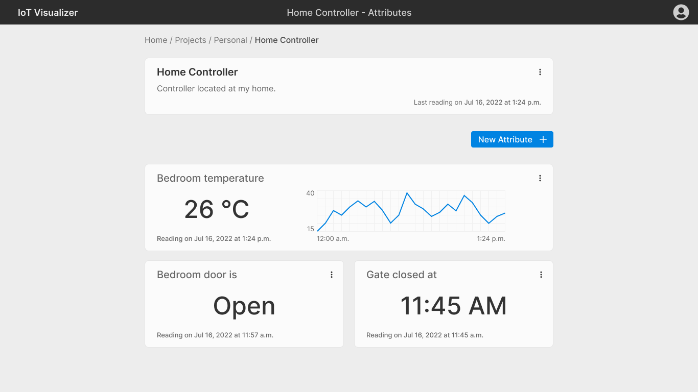

# IoT Visualizer - Frontend

Frontend for the [IoT Visualizer platform](https://github.com/rafaeltmbr/iot_visualizer) project.



## Installation

Clone the repository

```
git clone https://github.com/rafaeltmbr/iot_visualizer_front.git
```

Install the dependencies

```
yarn install
```

## Development

Run the project with the following command

```
yarn start
```

By default the application server will start at http://localhost:3000. If you want the server to run in another port, specify it in the `PORT` environment variable, for example (starting the server at port 8081):

```
PORT=8081 yarn start
```
